# Chapter 1: Computer Networks and the Internet

## 1.1 - What is the Internet?

[Video](https://www.youtube.com/watch?v=74sEFYBBRAY) / [Knowledge checks](https://gaia.cs.umass.edu/kurose_ross/knowledgechecks/problem.php?c=1&s=1)

### Internet

- **Red de redes** interconectadas
- **Infraestructura** que ofrece **servicios** a aplicaciones distribuidas (involucran múltiples end systems que intercambian data entre ellos).
- Provee una **interfaz de programación** (API) a las aplicaciones → permite que las apps se conecten y utilicen el servicio de transporte de Internet

### Protocolos

- Rigen toda **comunicación** en el Internet.
- Definen tanto **el formato y el orden de los mensajes** intercambiados entre dispositivos en una red como las **acciones tomadas al transmitirlos y recibirlos**.
- Los end systems, packet switches, y otras piezas del Internet corren protocolos que controlan el envío y recibimiento de información en el Internet.
- Para que dos (o más) interlocutores puedan cumplir una tarea, deben correr el mismo protocolo.
- [Internet standards](https://www.ietf.org/about/introduction/): Establecen qué hace cada protocolo. Diferentes protocolos se usan para lograr distintas tareas*.*
- Protocolos principales del Internet: **TCP/IP**
    - **Transmission Control Protocol (TCP)**: Garantiza la transmisión confiable y ordenada de datos entre dos dispositivos en una red.
    - **Internet Protocol (IP):** Especifica el formato de los paquetes que se envían y reciben entre routers y end systems.
    
    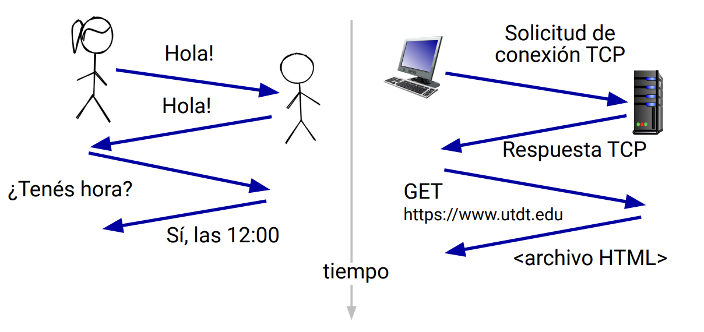
    

### **Hosts / end systems**

- **Dispositivos** que se conectan al Internet (ej: celulares, tablets, televisores).
- Se los llama así porque **corren aplicaciones en el “borde” de la red**
- Interconectados por una red de **enlaces de comunicación** y **conmutadores de paquetes.**
- Acceden al Internet mediante **ISPs (*Internet Service Providers*)**.
- Se pueden dividir en dos categorías: **clientes** y **servidores**.

### **Enlaces de comunicación (*communication links*)**

- Cada enlace tiene una *transmission rate* (medida en bits por segundo)
- When one end system has data to send to another end system, the sending end system segments the data and adds header bytes to each segment. The resulting packages of information (**paquetes**) are then sent through the network to the destination end system, where they are reassembled into the original data.

### **Conmutadores de paquetes (*packet switches*)**

- Reenvían **paquetes (agrupaciones de bytes–datos)** a su destino final (un end system)
- Los más utilizados*: Routers* y *switches*

### **Redes (*Route / Path*)**

- **Secuencia de enlaces de comunicación y conmutadores de paquetes** atravesada por un paquete del end system emisor al end system receptor.
    
    Ejemplo del libro:
    
    *Consider a factory that needs to move a large amount of cargo to some destination warehouse located thousands of kilometers away. At the factory, the cargo is segmented and loaded into a fleet of trucks. Each of the trucks then independently travels through the network of highways, roads, and intersections to the destination warehouse. At the destination warehouse, the cargo is unloaded and grouped with the rest of the cargo arriving from the same shipment.* 
    
    *Thus, in many ways, packets are analogous to trucks, communication links are analogous to highways and roads, packet switches are analogous to intersections, and end systems are analogous to buildings. Just as a truck takes a path through the transportation network, a packet takes a path*
    *through a computer network.*
    

### ISPs (Internet Service Providers)

- *Redes de packet switches y enlaces de comunicación.*
- Proporcionan acceso a la red a los end systems y conectan los servers
- Los ISPs que otorgan acceso a los end systems deben estar interconectados*.*

Como interconectamos millones de ISPs? → **ISPs globales.** Todos estos ISPs globales deben estar interconectados

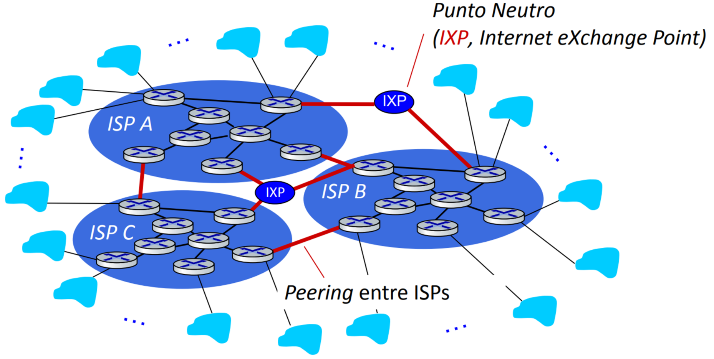

### La estructura de Internet

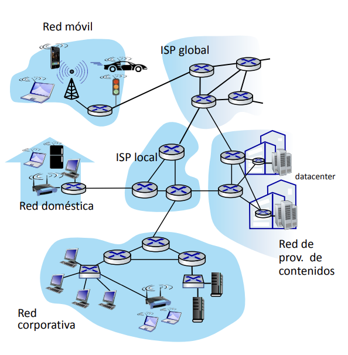

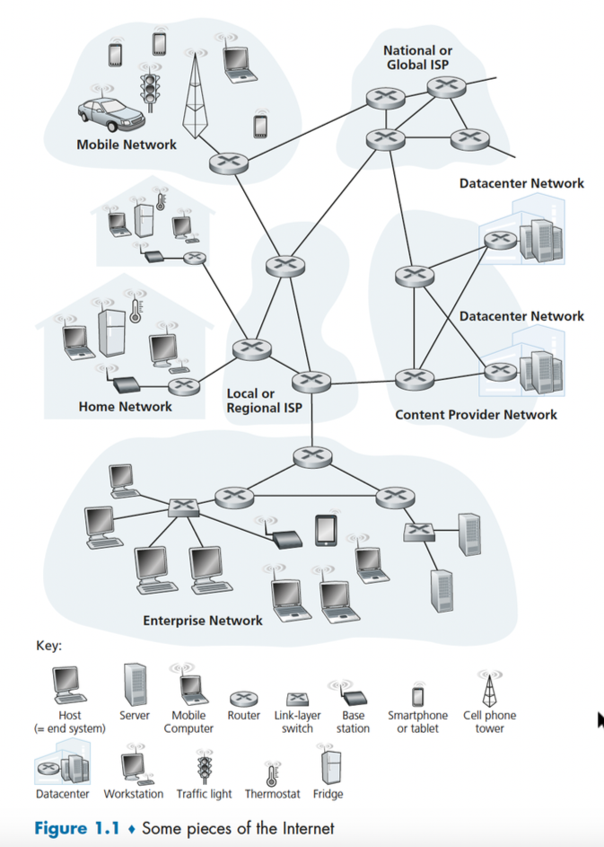

## 1.2 - The Network Edge

[Video](https://www.youtube.com/watch?v=k8NmM-hImBU) / [Knowledge checks](https://gaia.cs.umass.edu/kurose_ross/knowledgechecks/problem.php?c=1&s=2)

### Redes de Acceso

- La red que conecta físicamente a un host con el primer router (”*edge router*”) en una red desde el end system hacia otro end system.
- **Redes de acceso doméstico: DSL, Cable, FTTH, y 5G Fixed Wireless**
    
    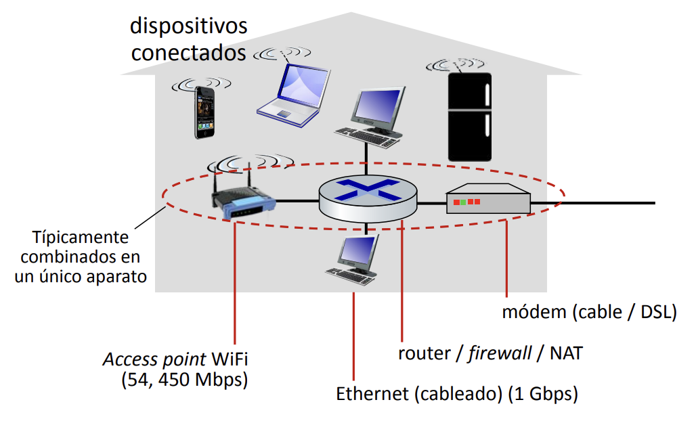
    
    - **DSL**
        - Típicamente, un hogar obtiene acceso a Internet DSL de la misma compañía telefónica (telco) que brinda su acceso telefónico local por cable. Por ende, cuando se utiliza DSL, el telco de un hogar también es su ISP.
        - Transmisión en distintas frecuencias
            - Los datos sobre la línea DSL salen hacia Internet
            - La voz se redirige hacia la red telefónica
        
        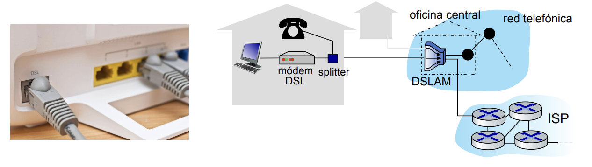
        
    - **Cable** → Multiplexación por División en Frecuencia (FDM): diferentes canales
    transmitidos en diferentes bandas de frecuencia
        
        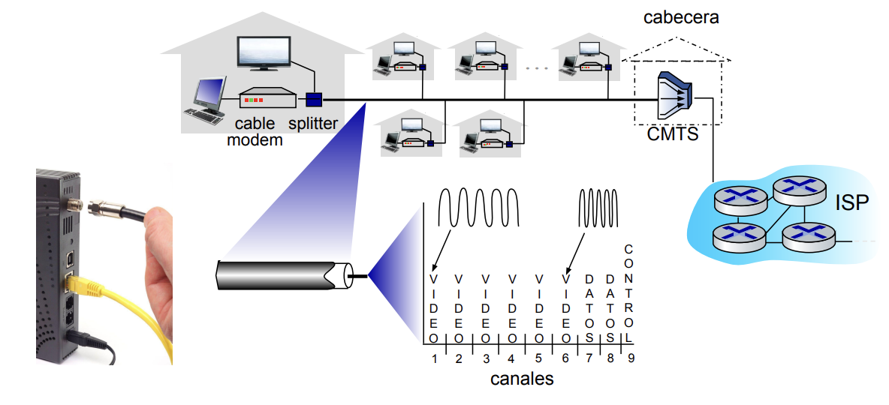
        
    
- **Redes de acceso institucional/corporativo: Ethernet y WiFi**
    
    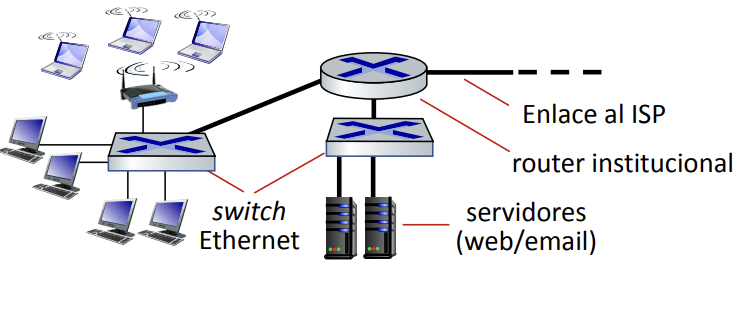
    
    - Universidades, empresas, etc.
    - Mezcla de tecnologías cableadas e inalámbricas conectando switches y routers
        - **Ethernet**: acceso cableado a 100 Mbps, 1 Gbps, 10 Gbps
        - **WiFi**: access points inalámbricos a 11, 54, 600 Mbps (o más)
- **Redes de acceso móbil (Wide-Area Wireless Access): 3G y LTE 4G y 5G**
    
    La red inalámbrica (compartida) conecta los hosts con el router mediante una estación base (access point)
    
    | Redes inalámbricas locales (WLANs) | Redes de acceso celular |
    | --- | --- |
    | ▪ En interiores; alcance de algunas decenas de metros
    ▪ 802.11b/g/n (WiFi): tasa de transmisión de 11, 54, 600 Mbps | ▪ Provistas por el operador de la red celular; de área amplia (decenas de kilómetros)
    ▪ Redes 4G de hasta 1 Gbps (5G próximamente; hasta ~20 Gbps) |

**Data centers**

- Las máquinas detrás de las aplicaciones de Internet.
- Se conectan al Internet e incluyen redes de computadoras complejas que interconectan sus hosts. Estos hosts muestran contenido, almacenan documentos y realizan cómputos.

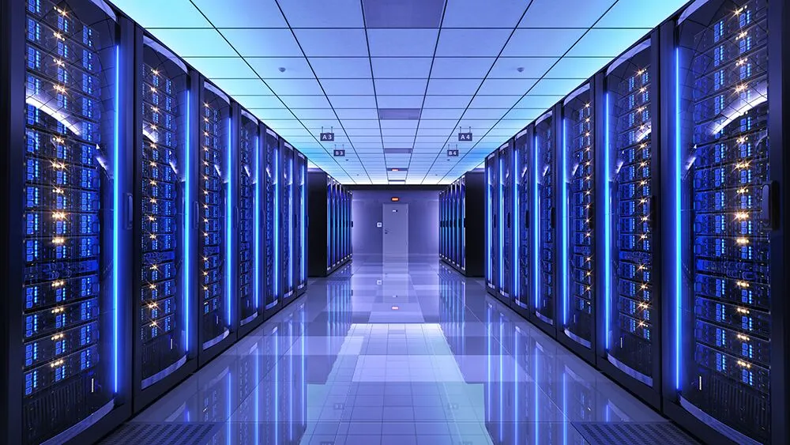

- Usados por **grandes empresas** (ej Google, Amazon, Microsoft) para distintos propósitos
    1. Páginas de e-commerce para usuarios
    2. Infraestructura para tareas específicas de la empresa
    3. Cloud computing a otras compañías
- La mayoría de los servers de los cuales recibimos, por ejemplo, resultados de búsquedas, e-mails, páginas web, videos y contenido de apps móbiles residen en grandes data centers.

### Medios Físicos

Entre pares de transmisores y receptores se propagan bits. Dicha propagación ocurre a través de un medio físico. El medio físico no necesariamente es del mismo tipo para cada par de transmisores y receptores a lo largo del path.

Dos tipos de medios:

- **Guiados**: Las señales se propagan en medios sólidos (Cable coaxil, fibra óptica, par trenzado)
    - **Cable coaxil (*coaxial cable*)**
        - Dos conductores de cobre concéntricos
        - Bidireccional → Se puede utilizar como un medio guiado compartido
        - Banda ancha → Múltiples canales/frecuencias, cientos de Mbps por canal
    - **Fibra óptica (*fiber cable*)**
        - Fibra de vidrio que transporta pulsos de luz (cada pulso es un bit)
        - Opera a altas velocidades (hasta cientos de Gbps)
        - Baja tasa de errores (inmune a interferencias electromagnéticas)
        - Costo alto de dispositivos ópticos
        - Se utilizan para enlaces transoceánicos
    - **Par trenzado (*twisted pair*)**
        - Dos cables de cobre aislados (telefonía Ethernet), que juntos constituyen un solo enlace de comunicación
            - Categoría 5: Ethernet de 100 Mbps, 1 Gbps
            - Categoría 6: Ethernet de 10 Gbps
        - Económico y muy utilizado
        - *Unshielded twisted pair* (UTP)*:* Comunmente utilizado para LANs, con data rates de entre 10 Mbps y 10 Gbps (depende del espesor del cable y la distancia entre transmisor y receptor).
- **No guiados:** Las señales se propagan libremente (Radio)
    - Canales de radio: Señales transportadas en bandas del espectro electromagnético
        - Un medio atractivo → No requieren un cable para ser instalados. Pueden penetrar paredes, brindar conectividad a un móbil y trabajar a largas distancias
        - Efectos del entorno de propagación→ reflexión, obstrucción por objetos, interferencia pueden afectar la fuerza de la señal
        - Ejemplos:
            - Wireless LAN (WiFi) → Hasta cientos de Mbps (o más); decenas de metros
            - Área amplia (4G) → Hasta 1 Gbps; ~10 Km
            - Bluetooth → Distancias cortas; velocidades limitadas
            - Microondas terrestres → Punto a punto; canales de 45 Mbps
            - Satélites → Hasta 45 Mbps por canal. Latencias de ~280 mseg
        

| Ejemplos de tecnologías de acceso a la red | Qué medio(s) utilizan |
| --- | --- |
| **DSL** | Fibra óptica y cable coaxil |
| **HFC** | Cable trenzado |
| **Ethernet** | Cable trenzado |
| **Redes de acceso móbil** | Radio |

## 1.3 - The Network Core

[Video](https://www.youtube.com/watch?v=f1nUcCdQJ8Y) / [Knowledge checks](https://gaia.cs.umass.edu/kurose_ross/knowledgechecks/problem.php?c=1&s=3)

### El núcleo de Internet

- Malla de routers interconectados
- Basado en conmutación de paquetes (packet switching)
- La red reenvía (forwards) paquetes de un router al siguiente a través de los enlaces que conforman el camino entre el origen y el destino

### Packet Switching

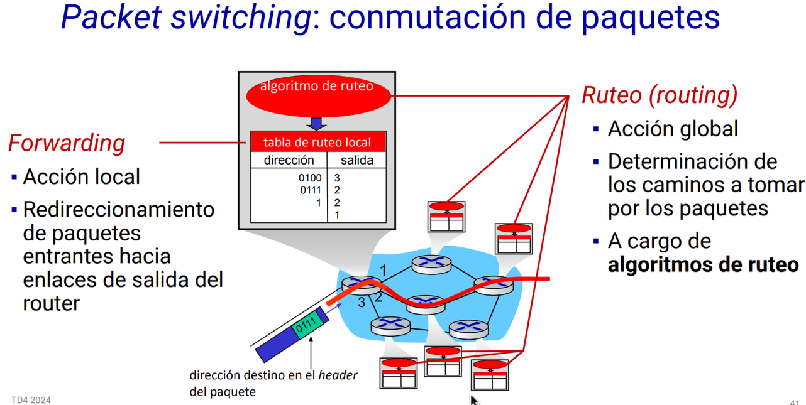

Los hosts intercambian mensajes. Estos mensajes pueden realizar una tarea de control contener data (ej: un e-mail, una imagen JPEG, un archivo MP3), etc.

Cómo funciona:

- Para enviar un mensaje desde un source host a un host destinatario, el source lo descompone en porciones más chicas: **paquetes de L bits.**
- Entre el source y el destino, cada paquete viaja mediante enlaces de comunicación y packet switches a una **tasa de transmisión R.**

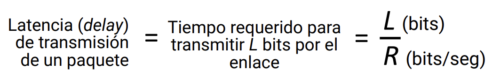

R depende de la tecnología del enlace. L depende del tamaño del paquete. El tamaño del paquete se define en el protocolo.

- **Toma L/R segundos transmitir un paquete por el enlace a tasa R bps**.
- El paquete debe llegar **completo** al router antes de poder redirigirse al siguiente enlace (***store-and-forward***).
    
    **¿Cuánto tiempo pasa desde que el source empieza a enviar el paquete hasta que el destino lo recibe completo (ignorando el delay de propagación)?**
    
    - Si tenemos un solo paquete: **2L/R segundos**
        - El source empieza a transmitir en el segundo 0.
        - En el segundo L/R , el source ya ha transmitido el paquete entero, y este fue recibido y almacenado en el router. En este momento, el router puede empezar a transmitir el paquete hacia el destino.
        - En el segundo 2L/R, el router ya ha transmitido todo el paquete, y este fue recibido en el destino.
        
        Luego, el delay total es de **2L/R segundos.**
        
    - Si tenemos 3 paquetes: **4L/R segundos**
        - *Como en el caso anterior, el router reenvia el primer paquete en el segundo L/R. A la vez, ya que acaba de terminar de enviar el primer paquete, el source comenzará a enviar el segundo. Luego, en el momento 2L/R, el destino recibe el primer paquete y el router recibe el segundo.*
        - *En el segundo 3L/R, el destino recibió los dos primeros paquetes y el router recibió el tercero.*
        - *Finalmente, en el segundo **4L/R**, el destino recibió todos los paquetes.*
    
    A estos tiempos habría que incluirles el delay de propagación  (tiempo que tarda el router en recibir, guardar y procesar todos los datos el paquete antes del forwarding).
    
    Otro caso a considerar: Se envia un paquete de S a D a través de un path con N enlaces con rate R (N-1 routers entre S y D). **El delay total es N * (L/R).**
    

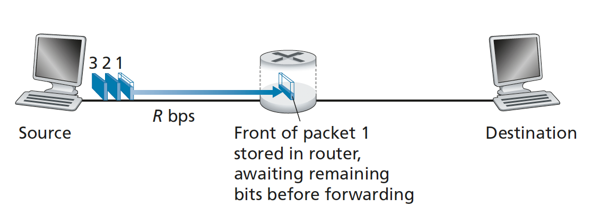

### Delay de encolamiento y packet loss

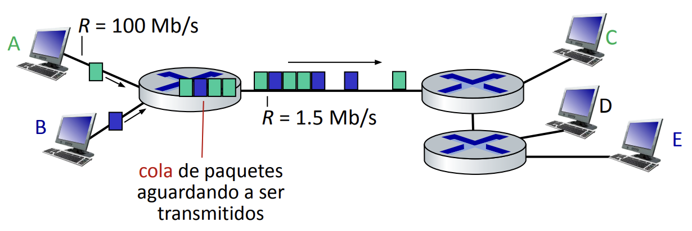

- Cada packet switch se conecta a múltiples enlaces, toma un paquete que llega a uno de esos enlaces y lo reenvia (forward) a otro enlace. Por cada enlace, el packet switch tiene una cola de outputs, que almacena paquetes que el router está por enviar por ese enlace.
- El **encolamiento** sucede cuando el trabajo llega más rápido que lo que puede ser atendido. Es decir, si un paquete que llega necesita ser transmitido por un enlace que está ocupado transmitiendo otro paquete, el paquete debe esperar en la cola.
- El **delay de encolamiento** depende del nivel de congestión en la red.
- **Si la tasa de arribo al packet switch (en bps) supera a la tasa de transmisión** durante un período de tiempo, se encolarán paquetes esperando a ser transmitidos. Ya que el espacio de la cola es finito, un paquete se **descarta** y se pierde si encuentra los **buffers** completos (***packet loss***). Este paquete pueden (o no) ser retransmitido.
    
    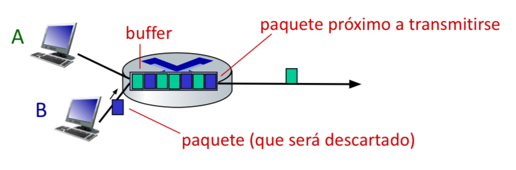
    
- Intensidad del tráfico
    
    
    - **L*a*/R** (*a*: La average rate en la que los paquetes llegan a la cola. Asume que todos los paquetes tienen L bits). No debe ser mayor a 1.
    - Si los paquetes llegan de a uno periódicamente (es decir, cada L/R segundos llega un nuevo paquete), cada paquete encontrará la cola vacía y no habrá delay de encolamiento.
    - Si los paquetes llegan en ráfagas (periódicamente), el delay de encolamiento promedio puede ser alto.
    
    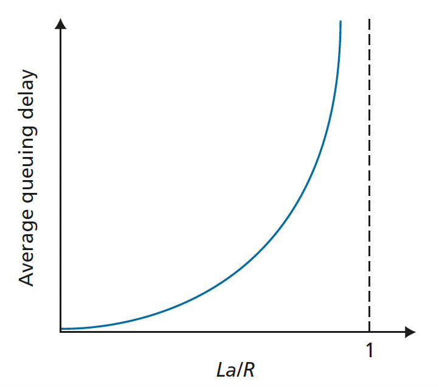
    
    - **Típicamente, el proceso de llegada a la cola es random; las llegadas no siguen ningún patrón y las llegadas de paquetes están separadas por cantidades aleatorias de tiempo.** En este caso, la cantidad La/R no alcanza para analizar el delay de encolamiento.

---

### Reenvio de paquetes (*packet forwarding*)

¿Cómo determina un router a qué enlace enviar un paquete recibido?

- En el Internet, cada end system tiene una **dirección de IP**. Cuando un host source quiere enviar un paquete a un host destino, el source incluye la dirección IP del destinatario en el header del paquete.
- Cada router tiene una **tabla de reenvíos (*forwarding table*)** q**ue mapea direcciones destino a los enlaces de salida (*outbound links*) del router.** Cuando un paquete llega a un router, el router examina la dirección y la busca en la tabla para encontrar el enlace correspondiente.
- ¿Cómo se setea una tabla de reenvíos? → **protocolos de enrutamiento** **(*forwarding protocols*)**
    
    The Internet has a number of special routing protocols that are used to automatically set the forwarding tables. A routing protocol may, for example, determine the shortest path from each router to each destination and use the shortest path results to configure the forwarding tables in the routers.
    

### Circuit Switching (Conmutación de circuitos)

- Se produce una **reserva previa de recursos** para la comunicación entre hosts.
- **Recursos dedicados, no compartidos** → Si reservo y me otorgan el recurso, puedo transmitir el tiempo que yo quiera y así se evita el encolamiento
    - Se utiliza en las redes telefónicas
        
        *Consider what happens when one person wants to send information (voice or facsimile) to another over a telephone network. Before the sender can send the information, the network must establish a connection between the sender and the receiver. This is a bona fide connection for which the switches on the path between the sender and receiver maintain connection state for that connection. This connection is called a circuit. When the network establishes the circuit, it also reserves a constant transmission rate in the network’s links (representing a fraction of each link’s transmission capacity) for the duration of the connection. Since a given transmission rate has been reserved for this sender-to-receiver connection, the sender can transfer the data to the receiver at the guaranteed constant rate.*
        

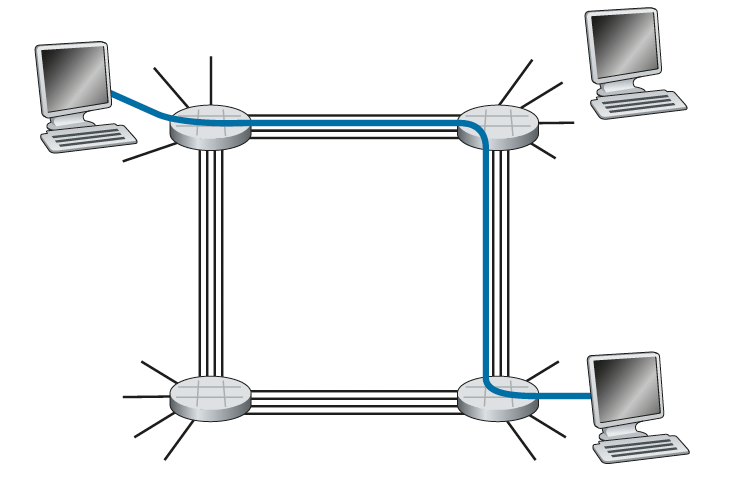

*Una red simple de circuit-switch. Consiste de 4 switches y 4 enlaces.*

- Se pueden implementar de dos formas: **FDM** o **FDT**
    
    
    - **Multiplexación por División de Frecuencia (FDM)** → Ancho de banda total dividido en bandas de frecuencias. Menos capacidad, más tiempo.
    - **Multiplexación por División de Tiempo (FDT)** → Tiempo dividido en intervalos. Más capacidad, menos tiempo.
    
    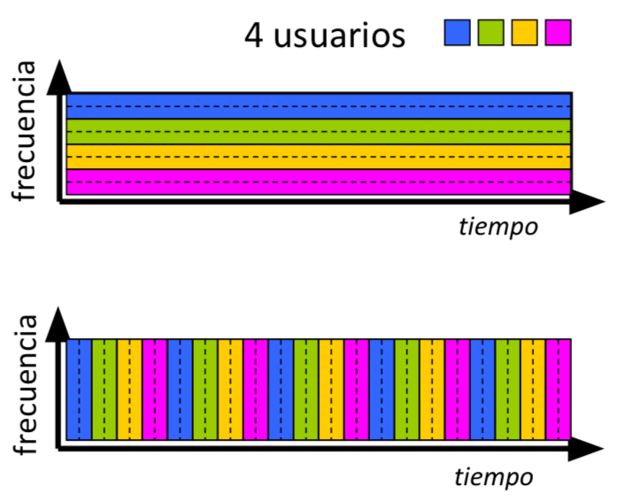
    
- Problemas
    - Un circuito permanece inactivo si no está siendo utilizado en una conexión → Desperdicio de recursos
    - Requiere un software complejo para coordinar la operación de los switches a lo largo del end-to-end path.

### Packet Switching vs Circuit Switching

| Packet Switching | Circuit Switching |
| --- | --- |
| Los recursos se utilizan *on **demand*** | Los recursos se **reservan** previamente |
| Recursos **compartidos** → Puede haber encolamiento y packet loss. Delays impredecibles. | Recursos **dedicados** → no hay encolamiento ni packet loss |
| Los datos se envían en **paquetes independientes** (toman rutas distintas). Ideal para datos “en ráfagas”. | Un canal dedicado: **Circuito** → Conexión física entre el source y el destino. Se utiliza para conexiones continuas (ej: llamadas telefónicas). |
| Menores costos, más fácil de implementar | Mayores costos, más difícil de implementar |

**Más eficiente → Packet Switching** (se aprovechan más los recursos, ya que se asignan *on demand*)

## 1.4 - Delay, Loss, and Throughput in Packet-Switched Networks

[Video](https://www.youtube.com/watch?v=hm1y4LsphQQ) / [Knowledge checks](https://gaia.cs.umass.edu/kurose_ross/knowledgechecks/problem.php?c=1&s=4)

<aside>
🚨 En las packet-switched networks, se tienen en cuenta **3 factores importantes**:

- La **tasa de transferencia** (*throughput*) entre hosts
- El **delay total** entre hosts
- El **packet loss**
</aside>

### Tipos de delay

Durante el viaje a lo largo del path (desde que parte del source hasta que llega al destino), un paquete sufre distintos tipos de *delays* en cada nodo (host o router) que afectan la performance de las apps.

- **Delay de procesamiento** → Tiempo que le toma al router leer los datos del paquete. Siempre se mide por paquete y en microsegundos.
- **Delay de encolamiento** → Tiempo de espera en los buffers del enlace de salida hasta ser transmitido (depende de la congestión del router).
- **Delay de transmisión** → Cuanto tarda el router en empezar a transmitir un paquete completo. Se calcula → **L/R** (L: longitud del paquete en bits; R: tasa de transmisión en bps). No depende de la distancia entre los routers.
- **Delay de propagación** → Cuanto tarda el mensaje en llegar de un lugar a otro. Los bits se propagan a la velocidad de propagación del enlace. Se calcula → **D/S** (D: Distancia; S: Velocidad de propagación).

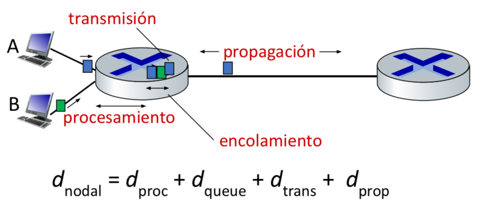

Delay nodal (delay en un router) = suma de todos los delays

### End-to-end delay

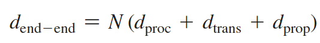

Suponiendo que hay N-1 routers entre los hosts

### Tasa de transferencia (*throughput*)

- **La cantidad efectiva de bits por segundo que se pueden transferir de un host a otro**
    - **Instantáneo**: En un punto dado en el tiempo. El rate (en bits/s) al que el host destinatario recibe un archivo.
    - **Medio**: F/T bits/s (Siendo F el tamaño del archivo en bits y T la cantidad de segundos que toma al host destino recibir todos los bits). A lo largo de un período de tiempo prolongado.

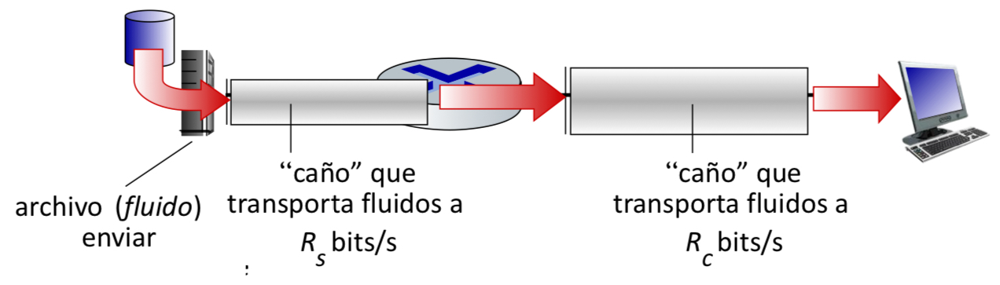

Rs: Entre el server y el router ; Rc: Entre el router y el cliente

- Si **Rs < Rc**, los bits enviados por el server “fluyen” por el router y llegan al cliente en un rate de Rs bps → **throughput = Rs**
- Si **Rs > Rc**, el router no podrá reenviar bits tan rápidamente como los recibe → **throughput = Rc.**

Entonces:

- **throughput = min{Rc, Rs} = tasa de transmisión del bottleneck del enlace**
- **Tiempo aprox de enviar un archivo de F bits del server al cliente = F/min{Rs, Rc}**.

En una red con **N enlaces** entre el server y el cliente, con las tasas de transmisión de los N enlaces siendo R1, R2, …, RN. Siguiendo el mismo análisis, el throughput en este caso es **min{R1, R2, … , RN}** (es decir, la tasa de transmisión del actual bottleneck)**.**

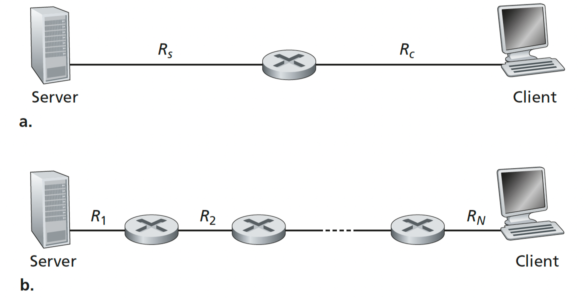

### Throughput: ejemplo basado en Internet

- 10 conexiones comparten de forma equitativa el enlace backbone de R bits/s.
- Asumimos que todos los enlaces de los servers tienen la misma tasa de transmisión Rs, y todos los enlaces de los clientes tienen tasa Rc.
- Throughput por conexión: mín**{Rc,Rs,R/10}**
- En la práctica, Rc o Rs suelen ser los bottleneck

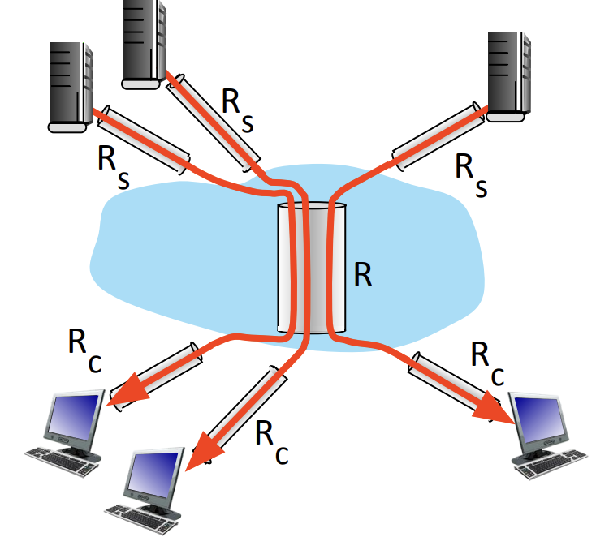

> **Conclusión → El throughput depende de las tasas de transmisión de los enlaces y del tráfico**
> 

## 1.5 - Protocol Layers and Their Service Models

[Video](https://www.youtube.com/watch?v=IZ_PnVXtMeY) / [Knowledge checks](https://gaia.cs.umass.edu/kurose_ross/knowledgechecks/problem.php?c=1&s=5)

### Capas y estructura de protocolos

- Una estructura explícita permite identificar y vincular los componentes del sistema → Modelo de referencia organizado en **capas.**
- La modularización facilita el mantenimiento del sistema. Los cambios en las implementaciones de una capa son transparentes para el resto del sistema
- Cada capa provee distintos **servicios…**
    - Realizando ciertas acciones en la capa
    - Utilizando los servicios de la capa inferior

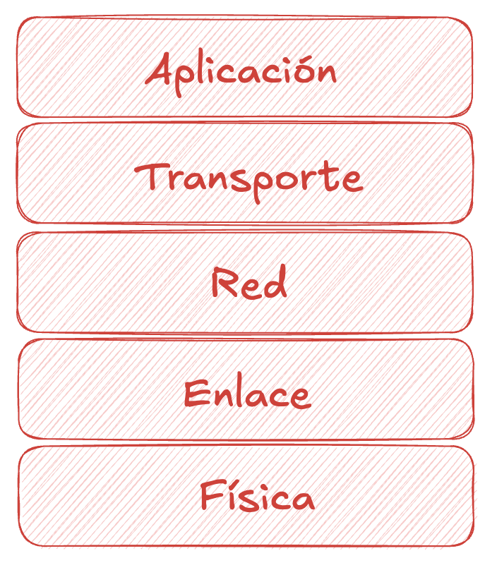

Stack de protocolos

| Capa | Función | Protocolos |
| --- | --- | --- |
| **Capa de aplicación** | Soporte para aplicaciones | HTTP, FTP, IMAP, SMTP, DNS |
| **Capa de transporte** | Transferencia de datos entre procesos | TCP, UDP |
| **Capa de red** | Ruteo de datagramas de origen a destino | IP, OSPF, BGP |
| **Capa de enlace** | Transferencia de datos entre dispositivos de red adyacentes | Ethernet, 802.11 (WiFi) |
| **Capa física** | Transferencia de bits en el medio físico | - |

### Servicios, capas y encapsulamiento

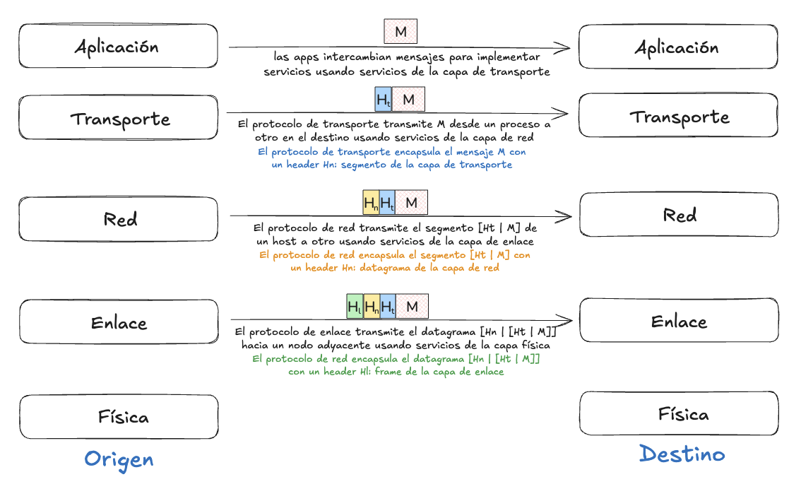

### Vista end-to-end

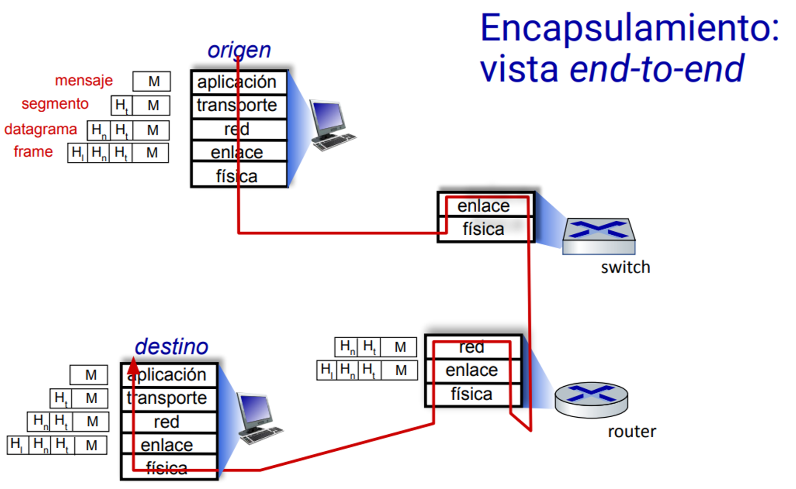