# Chapter 3: Transport Layer

## 3.1 - Introduction and Transport-Layer Services

[Video](https://www.youtube.com/watch?v=lAvhH0XJLNE) / [Knowledge checks](https://gaia.cs.umass.edu/kurose_ross/knowledgechecks/problem.php?c=3&s=1)

- **Capa de red/IP**→ Canal de comunicación lógico “*best effort*” **entre hosts**
    - La **capa de transporte** extiende este servicio → Ofrece un canal de comunicación lógico **entre procesos** corriendo en diferentes hosts
- Acciones del nivel de transporte
    - **Emisor**: Divide mensaje de aplicación en **segmentos**; los envía a la capa de red
        
        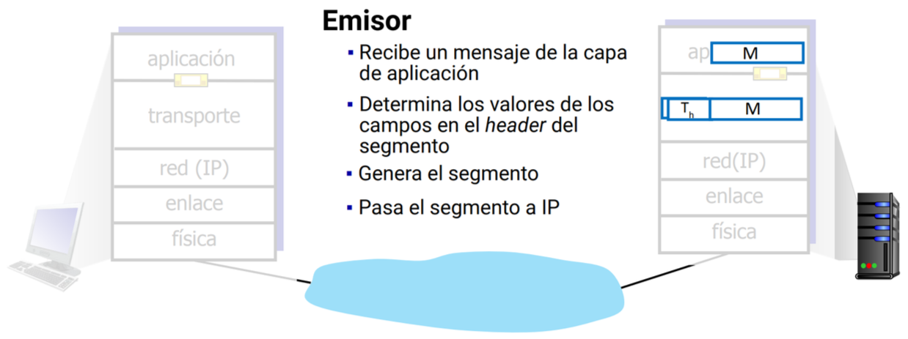
        
    - **Receptor**: ensambla mensajes a partir de los segmentos; los pasa a la capa de aplicación
        
        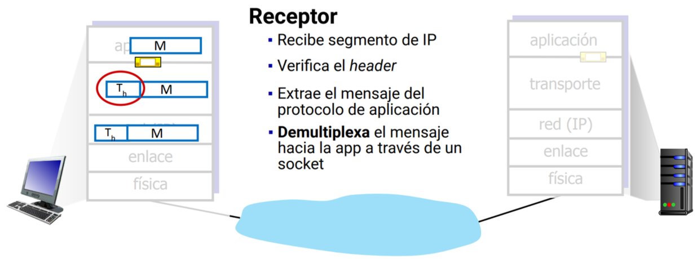
        
- Los protocolos de transporte “viven” en los end systems → Pueden enviar mensajes de los procesos de aplicación a la capa de red, pero no pueden controlar que sucede en la capa de red
- Dos protocolos de transporte disponibles para aplicaciones en Internet: **TCP y UDP**
    
    
    | TCP: Transmission Control Protocol | UDP: User Datagram Protocol |
    | --- | --- |
    | • Entrega confiable y en orden
    • Control de congestión
    • Control de flujo
    • Establecimiento de conexión | • Entrega no confiable y fuera de orden
    • “Best-effort” (extensión de IP)
    • No ofrece garantías de delay ni de ancho de banda; Sí ofrece multiplexación, demultiplexación y checksum |

## 3.2 - Multiplexing and Demultiplexing

**Demultiplexación**

- En el host destino, la capa de transporte recibe segmentos de la capa inferior (red).
- La capa de transporte debe capturar los **datos de cada segmento** y enviarlos al proceso de aplicación correspondiente (corriendo en el host). Envía los datos a un **socket intermediario**
    - Cada socket tiene un identificador único (tupla), que se escribe en *fields* especiales del segmento
    - El formato del identificador depende de si el socket es de TCP o de UDP.

**Multiplexación:**

- Se recolectan los datos de distintos socket, se encapsulan con un header (utilizado para demultiplexar luego)y se crea el segmento.
- El segmento es enviado a la capa de red

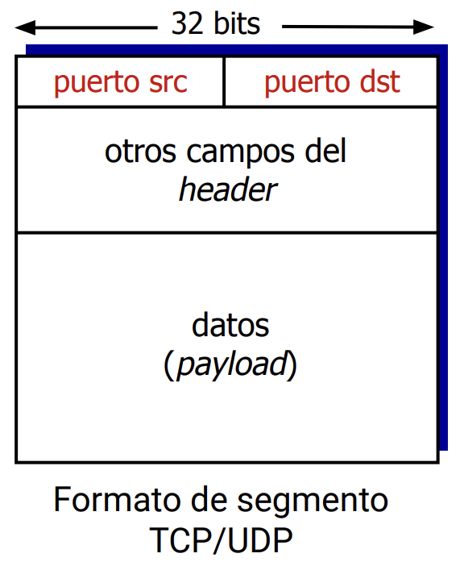

### Demultiplexación sin conexión (UDP)

- Al abrir un socket UDP, se debe indicar el puerto local a utilizar:
    
    `DatagramSocket socket = new DatagramSocket(12534);`
    
- Al crear un paquete para enviar al socket, se debe indicar:
    
     `(dirección IP destino, puerto destino)`
    
- Cuando un host recibe un segmento UDP:
    - Verifica el puerto destino en el segmento
    - Redirige el segmento al socket con dicho puerto

> **Los datagramas IP/UDP con el mismo puerto destino (pero distinta dirección IP y/o puerto origen) son redirigidos al mismo socket en el host receptor**
> 

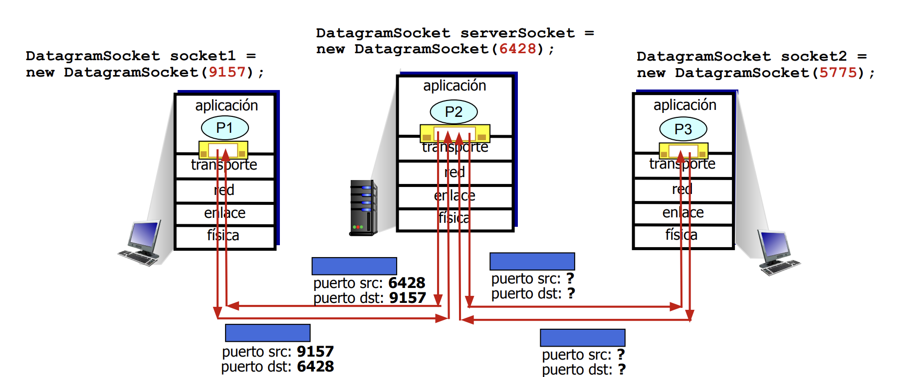

### Demultiplexación con conexión (TCP)

- Un socket TCP se identifica por la 4-upla:
    
    `(dirección IP origen, puerto origen, dirección IP destino, puerto destino` (Requerido para poder iniciar una conexión)
    
- El receptor emplea los cuatro valores para redirigir (demultiplexar) el segmento al socket correcto
- Un servidor puede manejar simultáneamente muchos sockets TCP

> **Ya que el identificador de socket TCP incluye la dirección y el puerto de origen, cada socket está asociado a un cliente distinto.**
> 

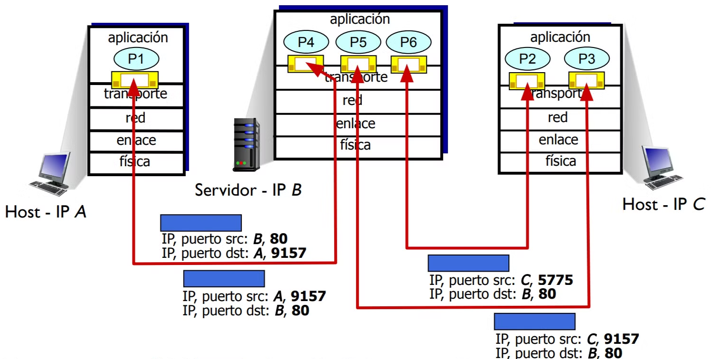

Tres segmentos dirigidos a la dirección IP B y puerto 80: demultiplexados hacia sockets distintos

- **HTTP Persistente** → Se intercambian todos los mensajes por el mismo socket durante la conexión
- **No persistente** → Crea y cierra una nueva conexión y socket para cada request/response
    - Esto puede impactar en la performance de los Web servers busy

### Resumen

<aside>
✍🏻

- La multiplexación/demultiplexación se basa en los valores de los headers del datagrama y el segmento
- **UDP:** Demultiplexación utilizando **sólo el puerto y la dirección IP destino**
- **TCP:** Demultiplexación utilizando la **4-upla conformada por las direcciones IP y los puertos origen y destino**
</aside>

## 3.3 - Connectionless Transport: UDP

### UDP (User Datagram Protocol) [[RFC 768](https://www.rfc-es.org/rfc/rfc0768-es.txt)]

- Protocolo de transporte de Internet básico → Solo proporciona **multiplexación / demultiplexación** y **checksum (no agrega casi nada a IP)**
- Servicio ***best effort***: los segmentos pueden extraviarse en la red o entregarse fuera de orden
- **No orientado a conexión**
    - Sin handshaking entre emisor y receptor (*connectionless*)
    - Cada segmento es procesado independientemente de los otros
- Se puede hacer confiable implementando el protocolo **QUIC** sobre UDP (en la capa de aplicación)

**Ventajas de UDP**

- Sin establecimiento de conexión (agrega delay por RTT)
- Sencillo: sin estado tanto en emisor como en receptor
- Header más chico (UDP: 8 bytes vs. TCP: 20 bytes)
- Puede funcionar ante la presencia de congestión

### UDP: acciones del nivel de transporte

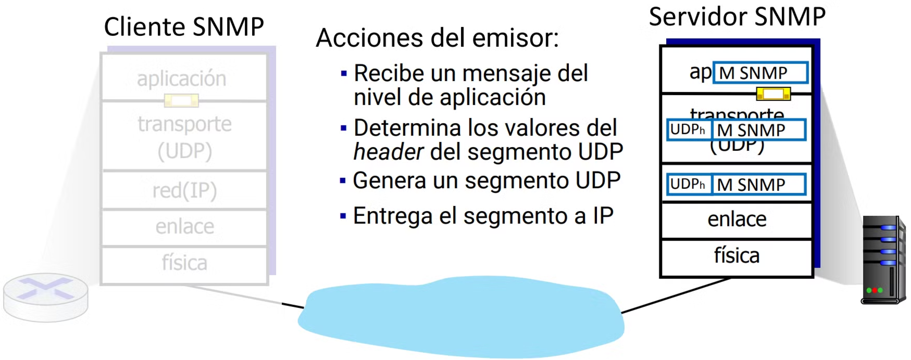

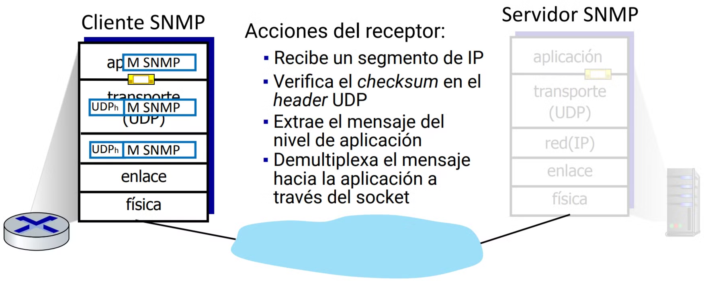

### Header UDP

- `Port numbers`: Para demultiplexar
- `Length`: Longitud (en bytes) del segmento (header + data).
- `Checksum`: Detección de errores
- Payload: datos de la aplicación

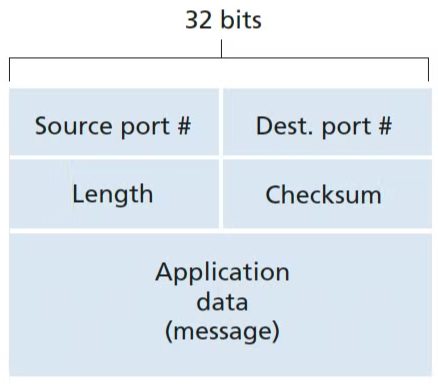

### Checksum

Objetivo: detectar errores en los bits del segmento transmitido

**Emisor**

- Interpreta el contenido del segmento como una secuencia de enteros de 16 bits (incluyendo header + direcciones IP)
- checksum: complemento a uno de la suma del contenido del segmento
- El valor del checksum se coloca en el header del segmento

**Receptor**

- Calcula la suma de las palabras de 16 bits del segmento recibido (incluido el checksum)
- Comprueba que el complemento a 1 de este valor sea 0
    - Si no es cero: error detectado!
    - Si es cero: no se detectaron errores

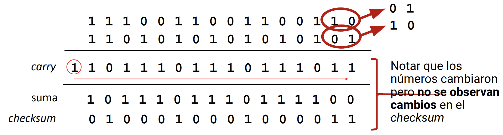

Ejemplo: suma (complemento a uno) de dos enteros de 16 bits

## 3.4 - Principles of Reliable Data Transfer

[Video 1](https://www.youtube.com/watch?v=nyUHUtmxWg0) / [Video 2](https://www.youtube.com/watch?v=vxgH6r-II2Q) / [Knowledge checks](https://gaia.cs.umass.edu/kurose_ross/knowledgechecks/problem.php?c=3&s=4) 

- La complejidad del protocolo depende del canal no confiable subyacente (ej. si corrompe, pierde y/o reordena datos) → Por ejemplo, IP no es confiable
- Los interlocutores no conocen el estado del otro (ej: el emisor no puede saber si
un mensaje fue recibido), la única forma de conocerlo es mediante el **intercambio de mensajes**

### API (abstracta) de un protocolo confiable

- `rdt_send()`: invocada desde la app para pasar datos a entregar al nivel de aplicación del receptor
- `udt_send()`: invocada por rdt para transmitir un paquete al receptor sobre el canal no confiable
- `rdt_rcv()`: invocada cuando llega un paquete por el canal
- `deliver_data()`: invocada por rdt para entregar datos a la capa de aplicación

Emisor

> **rdt_send(data)** crea un paquete que contiene los datos mediante la acción **make_pkt(data),** y los envía a la capa subyacente utilizando la acción **udt_send(packet)**.
> 

Receptor

> **rdt_rcv(packet)** recibe un paquete del canal, remueve el encabezado mediante **extract(packet,data)** y lo pasa a la capa del nivel superior mediante la acción **deliver_data(data).**
> 

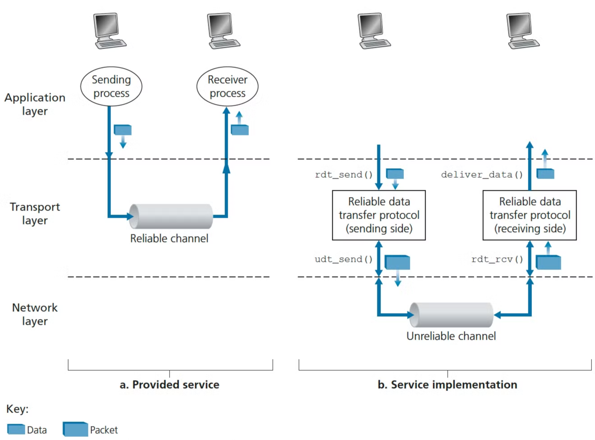

*Reliable data transfer: Service model and service implementation*

### Diseño de un protocolo confiable con FSMs

### rdt1.0: transmisión confiable sobre un canal confiable

- El canal no introduce errores en los bits ni pierde paquetes
- Tenemos una FSM para el emisor y otra para el receptor:
    - El emisor envía datos al canal subyacente
    - El receptor lee datos del canal

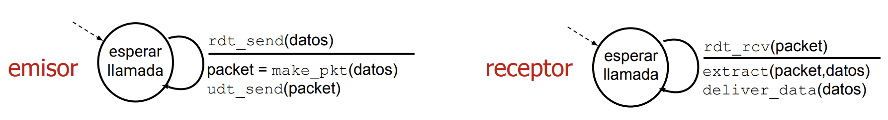

### rdt2.0: transmisión sobre un canal con errores

- El canal subyacente puede corromper bits en los paquetes → checksum
- **ACKs**: el receptor indica que el paquete llegó bien
- **NAKs**: el receptor indica que el paquete llegó con errores, y el emisor retransmite el paquete

> **Stop and wait: el emisor envía un paquete y luego espera la respuesta del receptor**
> 

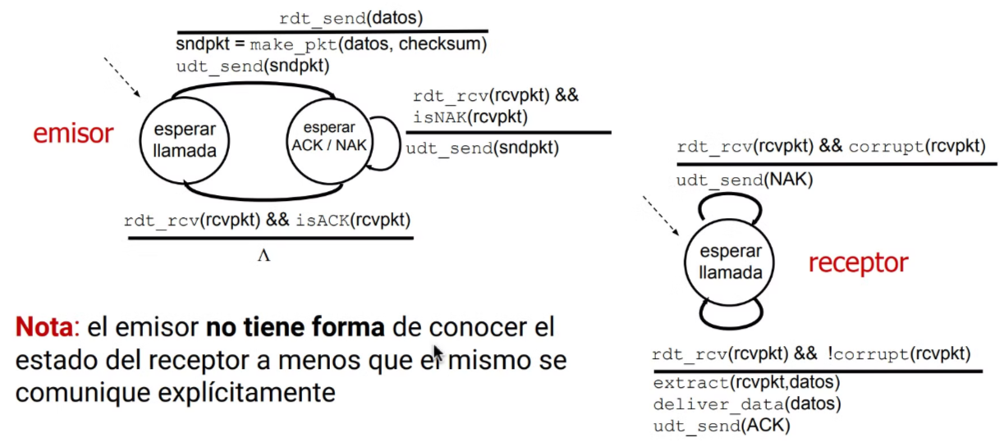

### rdt2.1: manejo de ACKs/NAKs corruptos

**Emisor**

- Agrega un **número de secuencia** a los paquetes (0 ó 1)
- Debe comprobar **corrupción de los ACKs/NAKs** recibidos
- Duplica la cantidad de estados → el estado debe recordar el número de secuencia del paquete esperado

**Receptor**

- Debe comprobar si el paquete recibido es un duplicado → el estado indica el número de secuencia del paquete esperado
- El receptor no puede saber si su último ACK/NAK llegó correctamente al emisor

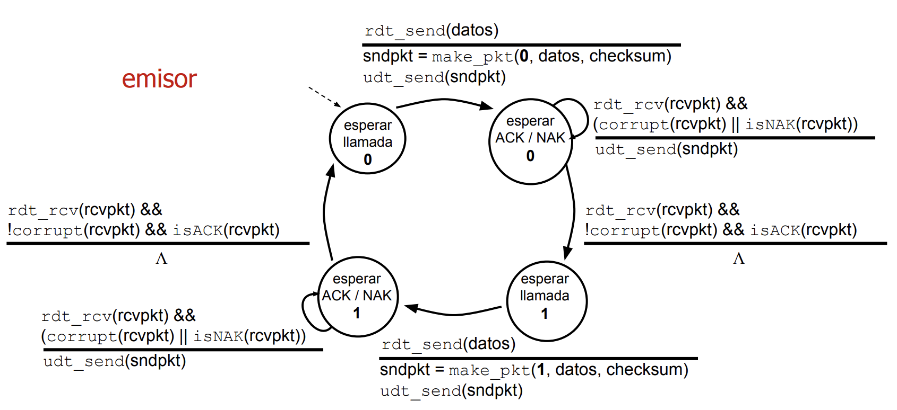

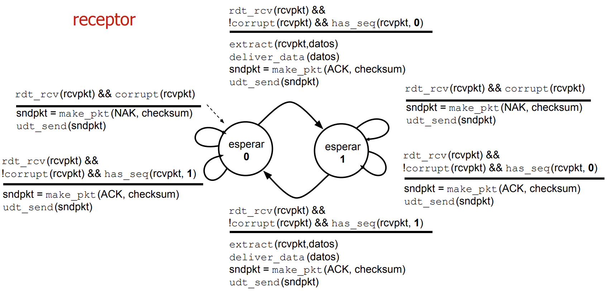

### rdt2.2: eliminando los NAKs

- En vez de un NAK, el receptor envía un ACK del último paquete recibido correctamente → El receptor debe indicar explícitamente el número de secuencia del paquete ACKeado
- Un ACK duplicado en el emisor dispara la misma acción que un NAK: retransmitir el paquete actual
    
    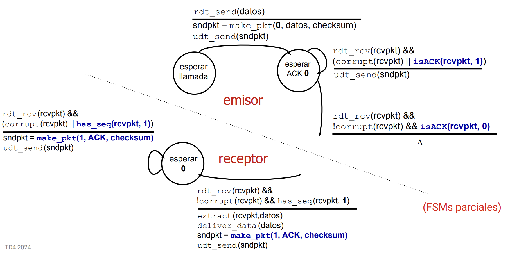
    

### rdt3.0: transmisión sobre un canal con errores y pérdidas

El emisor espera un ACK durante cierto tiempo

- Si no llega, retransmite el paquete
- Si hay demoras (en vez de pérdidas efectivas), La retransmisión causará duplicados (pero ya lo contemplamos con los números de secuencia). El receptor debe indicar el número de secuencia del paquete ACKeado
- La espera se controla con un timer que produce interrupciones cada
cierto intervalo de tiempo (**timeout**)

### Escenarios

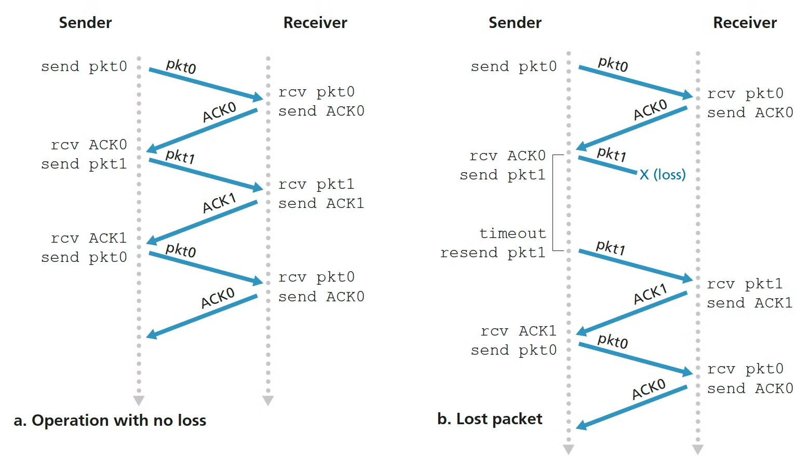

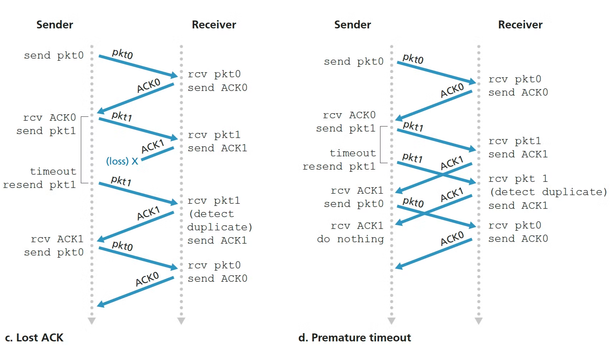

### rdt3.0: rendimiento (stop-and-wait)

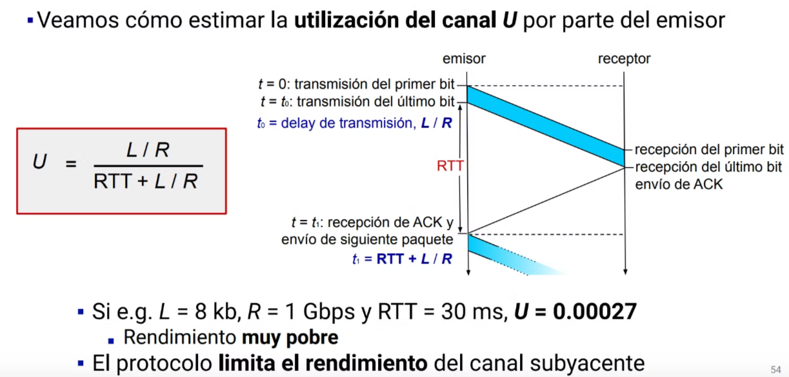

### rdt3.0: pipelining

Podemos **incrementar el rendimiento** mediante la técnica de **pipelining**

- El emisor mantiene **múltiples paquetes “en vuelo”** en vez de sólo uno (es decir, no espera la llegada del ACK de un paquete para transmitir el próximo).
- Requiere más números de secuencia (ya no puedo usar solo 0 y 1)**. Los números de secuencia respectivos se incrementan ante cada nueva transmisión**
- Se deben gestionar buffers (en el emisor y/o receptor)
    
    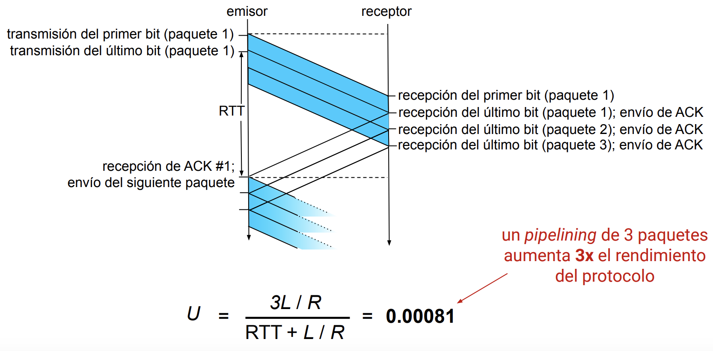
    

### Pipelining vía Go-Back-N (GBN)

El emisor mantiene una **ventana de hasta N paquetes en vuelo** (*sliding-window protocol).*

- Utiliza un número de secuencia (#SEQ) de k bits en el header

](imagenes/imagenesch3/gbn.png)

[Demo](https://media.pearsoncmg.com/aw/ecs_kurose_compnetwork_7/cw/content/interactiveanimations/go-back-n-protocol/index.html)

- **ACK acumulativo**, ACK(n): reconoce todos los paquetes hasta el de #SEQ n (incluido)
    - **Al recibir un ACK(n), se desplaza la ventana hacia adelante para comenzar en n+1**
- El timer corresponde al paquete en vuelo más antiguo → timeout(n) dispara una retransmisión del paquete n junto con todos los de #SEQ más grande en la ventana

**Receptor**

- El receptor siempre **envía un ACK para el paquete con el #SEQ más alto (en orden) recibido correctamente**
    - Puede generar ACKs duplicados
    - Debe recordar el siguiente #SEQ esperado, rcv_base
    
    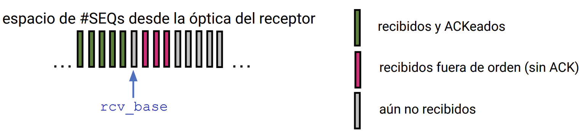
    
- Al recibir un paquete fuera de orden,
    - Es posible almacenarlo o descartarlo (decisión de implementación)
    - **Se reenvía ACK para el paquete con el #SEQ más alto recibido**

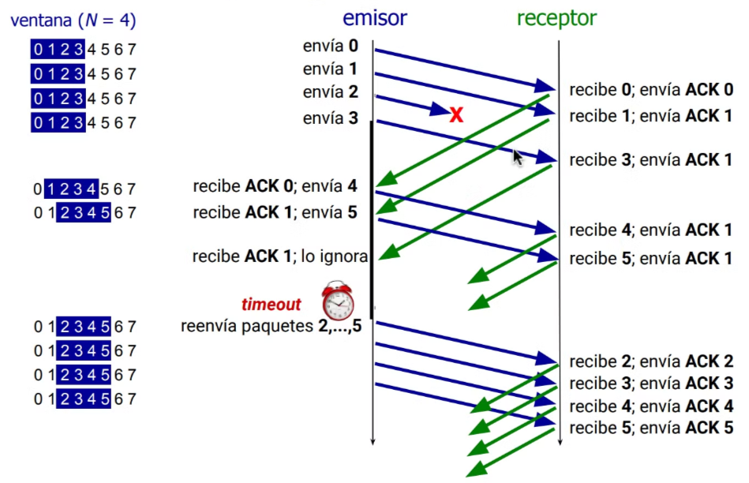

GBN: Ejemplo

### Pipelining vía Selective Repeat

[Demo](https://media.pearsoncmg.com/aw/ecs_kurose_compnetwork_7/cw/content/interactiveanimations/selective-repeat-protocol/index.html)

- El receptor **reconoce uno a uno cada paquete recibido correctamente. Almacena en buffers los paquetes para entregarlos (en orden)** a la capa superior, eventualmente
- El emisor dispara un timeout y **retransmite cada paquete individualmente.** Mantiene un timer por cada paquete sin ACK
- La ventana de emisión consta de N #SEQs consecutivos

**Emisor**

- Datos desde capa superior: Si el próximo #SEQ disponible está dentro de la ventana, enviar el paquete
- timeout(n): Reenviar paquete n; reiniciar timer
- ACK(n) en [send_base, send_base+N]
    - Marcar paquete n como recibido
    - Si n es el #SEQ más chico sin ACK, desplazar la base de la ventana al próximo #SEQ sin ACK
    

**Receptor**

- Paquete n en [rcv_base,rcv_base+N-1]: Enviar ACK(n)
    - Si está fuera de orden, almacenarlo
    - Si no, entregarlo (junto con otros en orden); desplazar ventana al siguiente #SEQ aún no recibido
- Paquete n en [rcv_base-N,rcv_base-1]: Enviar ACK(n)
- En cualquier otro caso: Ignorar y descartar el paquete R

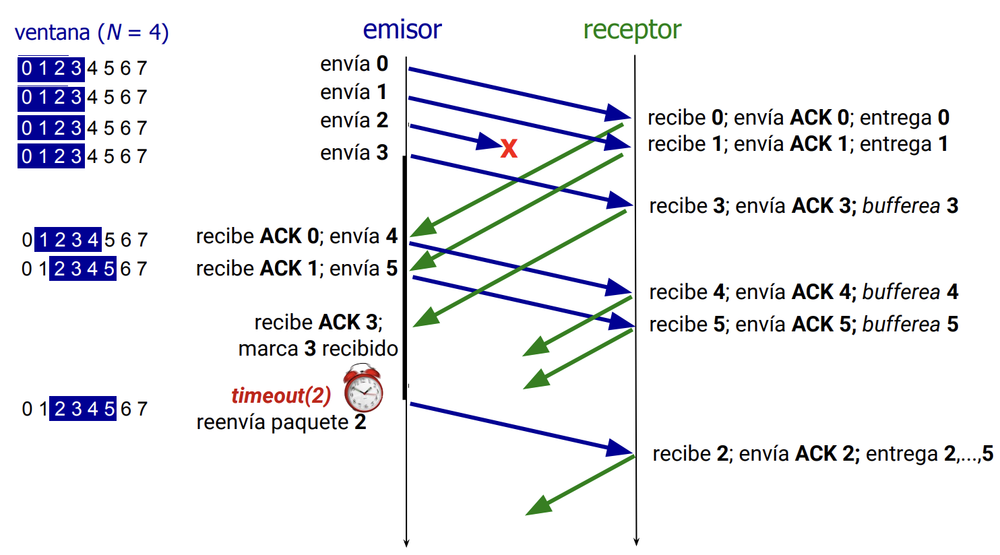

SR: Ejemplo

<aside>

**Resumen: Protocolos confiables**

- Ofrecen garantías de entrega preservando orden y libre de duplicados (incluso si el canal de comunicación subyacente es no confiable)
- Implementan los siguientes mecanismos:
    - **Checksums**: para detectar corrupción en los bits de un paquete
    - **Números de secuencia (#SEQs):** permiten ordenar el flujo de paquetes y detectar pérdidas o duplicados
    - **ACKs:** usados por el receptor para notificar la correcta recepción de un paquete
        - Suelen informar el #SEQ del paquete reconocido
        - Pueden ser individuales o acumulativos
    - **Timer:** para disparar retransmisiones de paquetes en el emisor, posiblemente debido a pérdidas (del paquete o bien de su ACK). Pueden generar duplicados
    - **Ventanas/pipelining:** aumentan la utilización del canal (U) permitiendo que múltiples paquetes puedan ser enviados (aún en el caso de no haber recibido sus respectivos ACKs)
</aside>

## 3.5 Connection-Oriented Transport: TCP

[Video 1](https://www.youtube.com/watch?v=UYJP-6mhF6E) / [Video 2](https://www.youtube.com/watch?v=E4I6t0mI_is) / [Knowledge checks](https://gaia.cs.umass.edu/kurose_ross/knowledgechecks/problem.php?c=3&s=5)

### TCP: Vista general

<aside>

- Punto a punto: **Un emisor y un receptor por conexión**
- Flujo (stream) de bytes **confiable y en orden**, sin límites entre mensajes
- Canal full-duplex: flujo de datos **bidireccional en la misma conexión**
- ACKs acumulativos
- Pipelining: La ventana de emisión se define mediante el control de flujo y el control de congestión
- Orientado a conexión: Se inicializa estado en los interlocutores el **handshaking** (intercambio de mensajes de control)
- **Control de flujo: Permite que el emisor no sature al receptor**
</aside>

> Recordar: El proceso que inicia la conexión TCP (es decir, realiza el primer paso del **three-way handshake**) es el cliente, y el otro proceso es el server.
> 
> 
> El proceso de aplicación cliente informa a la capa de transporte que quiere establecer una conexión con un proceso en el server mediante el comando `clientSocket.connect((serverName,serverPort))`
> 

Luego de establecer la conexión, los procesos comienzan a enviarse data

- El cliente envía datos a través del socket.
- Luego de que los datos “pasaron por la puerta”, TCP los dirige al **buffer de envío**
- TCP toma la data del buffer, la encapsula con un header y envía los **segmentos** a la capa debajo (red)
    - Tamaño del segmento delimitado por el MSS → Su datagrama debe ser menor o igual a la longitud del mayor frame de la capa de enlace que puede ser enviado por el host  **
- En la capa de red, los segmentos son encapsulados en **datagramas**, y son enviados a la red

### Estructura del segmento TCP

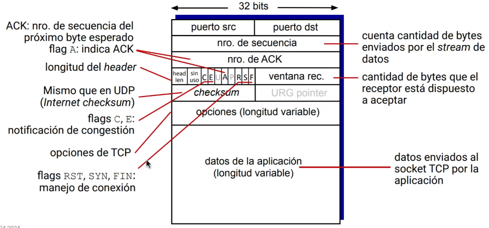

### Números de secuencia y ACKs

La data se divide en segmentos TCP de tamaño delimitado por el MSS

Ejemplo: Archivo de 500,000 bytes*,* MSS = 1000 bytes → 500 seg

- **Número de secuencia (#SEQ):** Índice en el stream de bytes del **primer byte en el payload**.
- **Número de ACK**: **Número de secuencia del siguiente byte esperado por el otro interlocutor**. ACK acumulativo

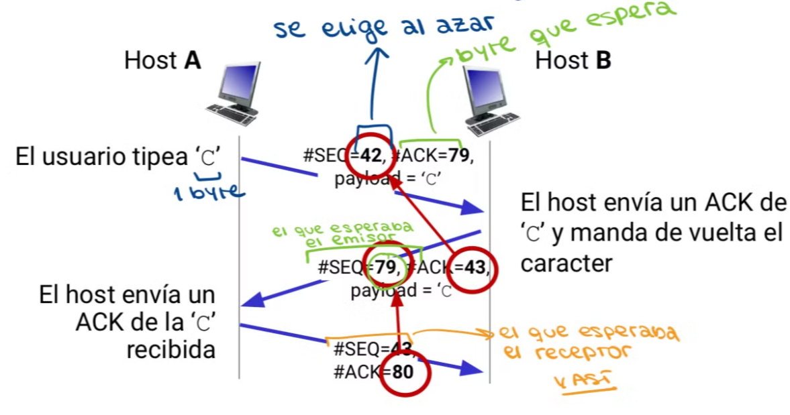

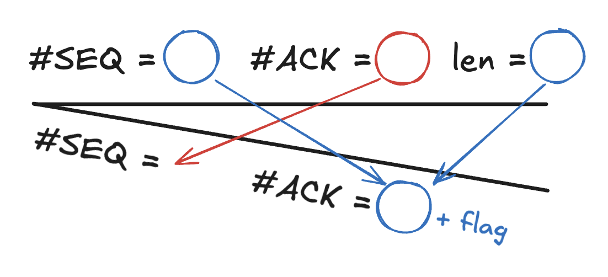

### Timeout y RTT en TCP

El timeout debe ser mayor que el RTT → El RTT es variable, TCP hace una estimación

> `EstimatedRTT = (1 - α) * EstimatedRTT + α * SampleRTT`
> 

SampleRRT: Tiempo transcurrido entre la transmisión de un segmento y la recepción de su ACK (ignorando retransmisiones)

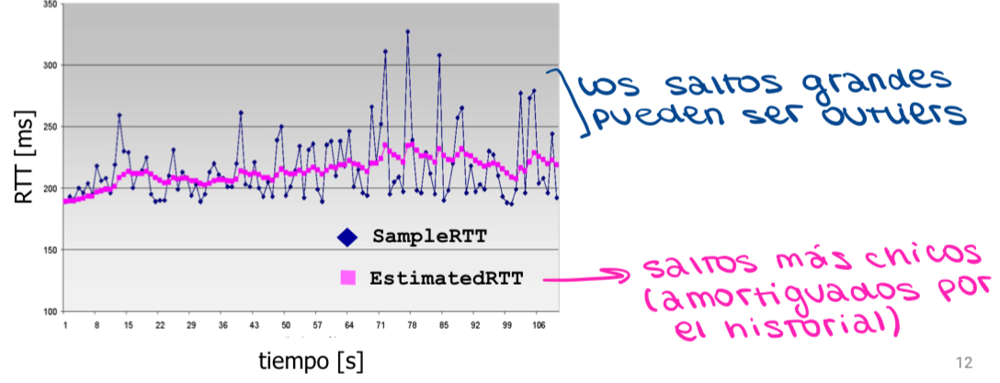

El timeout (RTO) se calcula como el RTT estimado + un márgen de seguridad (el desvío entre el RTT estimado y la muestra)

> `RTO = EstimatedRTT + 4 * DevRTT`
`DevRTT = (1 – β) * DevRTT + β * | SampleRTT – EstimatedRTT |`
> 

En general,  α = 0.125 y  β = 0.25

---

### Emisor TCP (simplificado)

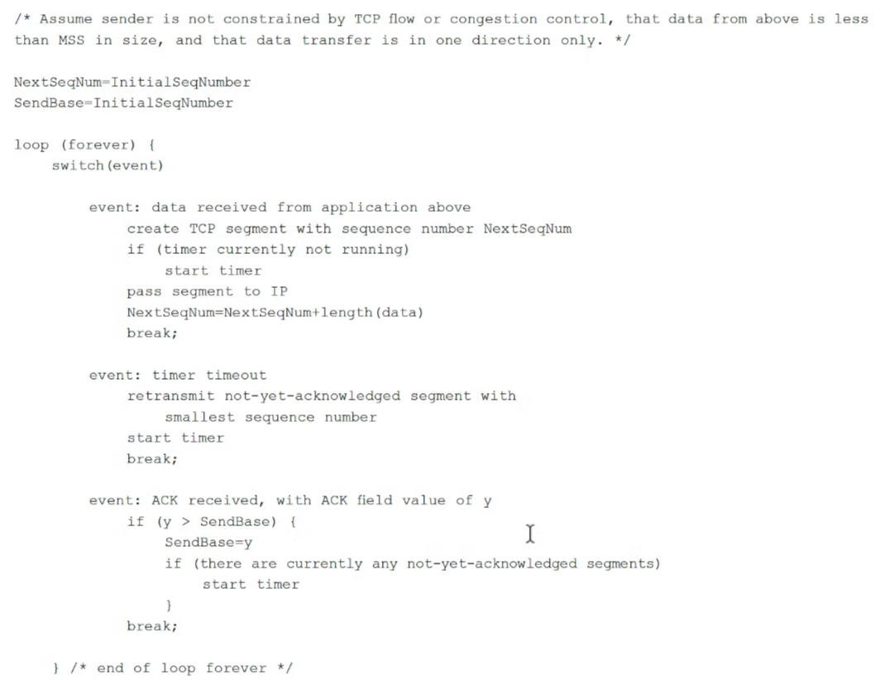

| Evento | Acciones |
| --- | --- |
| **Recepción de datos de la aplicación** | • Generar segmento con #SEQ y enviarlo a IP
• Disparar timer (si no está corriendo) → mide el tiempo del segmento + antiguo sin ACK, expira cuando se consume el RTO |
| **Expiración de timer** | Retransmitir segmento que causó el *timeout ,* reiniciar timer |
| **ACK recibido** | Si el ACK reconoce segmentos enviados anteriormente:
• Actualizar el puntero de bytes ACKeados
• Iniciar timer si aún hay segmentos sin ACK |

### Receptor TCP: Generación de ACKs

| Evento | Acciones |
| --- | --- |
| **Llegada ordenada de un segmento con un #SEQ esperado, toda la data anterior ya fue ACKeada** | ACK demorado. Esperar hasta 500ms la llegada ordenada de otro segmento. Si no sucede, enviar un ACK. |
| **Llegada ordenada de un segmento con un #SEQ esperado, un segmento anterior en espera de ACK** | Enviar un ACK acumulativo, ACKeando ambos segmentos. |
| **Llegada desordenada de un segmento con un #SEQ mayor al esperado. Pérdida detectada** | Enviar un ACK duplicado, indicando el número de secuencia del próximo byte esperado (el primero de la pérdida). |
| **Llegada de un segmento que llena parcial o completamente una pérdida** | Si el segmento comienza al principio de la pérdida, enviar un ACK. |

### Retransmisiones: 3 escenarios de ejemplo

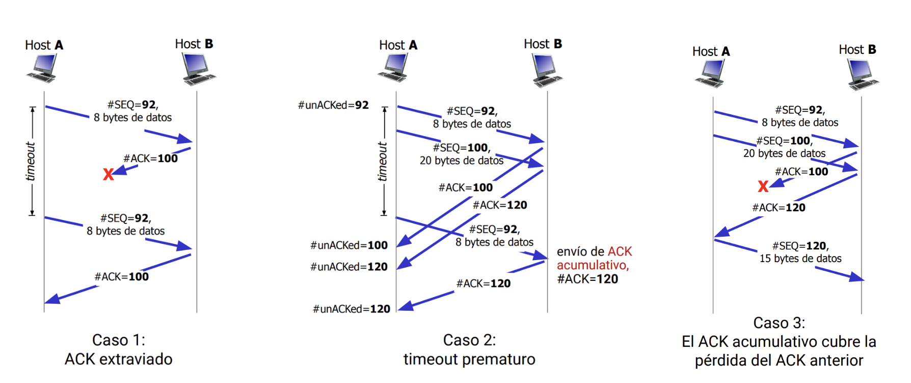

### TCP Fast Retransmit

> Si el emisor recibe **tres ACKs extra para los mismos datos**, **se reenvía el segmento sin ACK con el #SEQ más bajo** (probablemente se haya perdido, por lo que no se espera al RTO)
> 

La recepción de tres ACKs
duplicados indica **tres
segmentos recibidos luego de
un segmento faltante**: es
probable que esto se deba a una
pérdida, por lo que activa una
retransmisión de inmediato

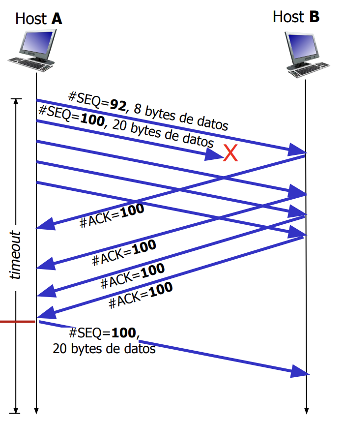

---

### Control de flujo en TCP: motivación

> El receptor controla al emisor de modo tal que **no sature los buffers** transmitiendo demasiado rápido
> 
- **rwnd** (**Receiver WiNDow)**: Cantidad de bytes que el receptor está dispuesto a aceptar

Cómo funciona:

- El receptor anuncia **espacio disponible en los buffers** en el campo **`rwnd`** del header TCP
    - El tamaño del buffer (`RcvBuffer`) puede definirse vía opciones del socket (suele ser 4096 bytes por defecto). Muchos SOs auto-ajustan el RcvBuffer

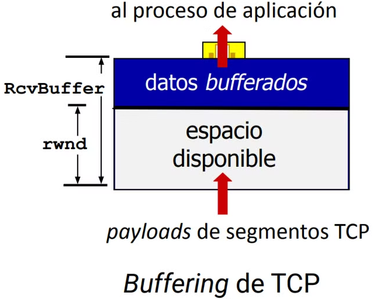

- **El emisor limita la cantidad de datos sin ACK (“en vuelo”) de acuerdo al valor recibido de rwnd → Garantiza que el buffer del receptor no se saturará ✅**
    
    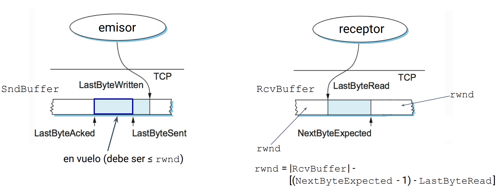
    

<aside>

Ventana efectiva = `rwnd - (LastByteSent - LastByteAcked)`

</aside>

---

### Establecimiento de conexión

[Bibliografía util](https://book.systemsapproach.org/e2e/tcp.html) (esto no está en el libro de Kurose)

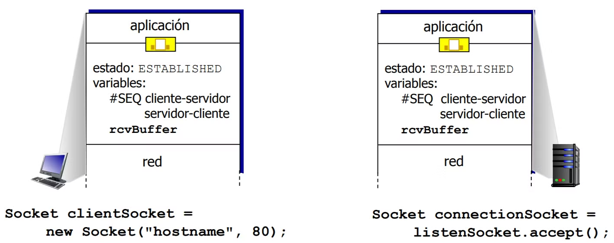

Handshake: 

- Acuerdo mutuo de establecer la conexión
- Acuerdo de parámetros (e.g., #SEQs iniciales; buffers)

**TCP realiza un handshaking de tres pasos → 3-way handshake**

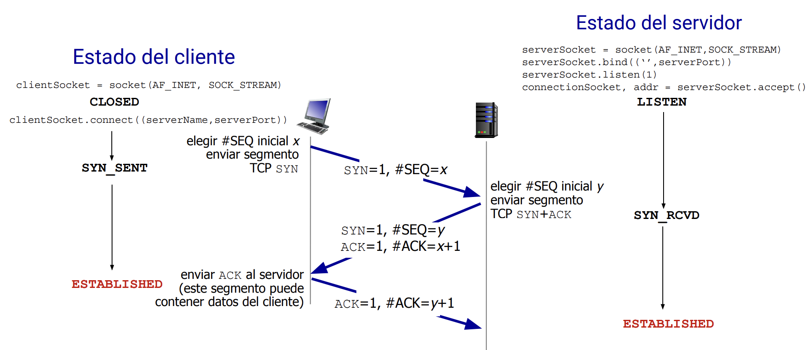

1. El cliente (quien inicia la conexión) envía un segmento al servidor con un #SEQ (`Flags` = `SYN`, `Seq = x`). Pasa del estado **CLOSED** a **SYN_SENT**.
2. El server está en **LISTEN**. Recibe el segmento y pasa al estado **SYN_RCVD**. Responde con un segmento que ACKea el #SEQ del cliente (`Flags = ACK, Ack = x + 1`) y declara su propio #SEQ(`Flags = SYN, Seq = y`). Por ende, en este mensaje se prenden las flags  `SYN` y `ACK` .
3. El cliente recibe el `SYN` `ACK` del server y pasa al estado **ESTABLISHED**. Le avisa al servidor enviando un segmento que ACKea el #SEQ del server (`Flags = ACK, Ack = y + 1, Seq = x + 1`). Al recibirlo, el server pasa también a **ESTABLISHED**, y se finaliza el handshaking.

### Cierre de conexión TCP

- Tanto el cliente como el servidor cierran su parte de la conexión cuando no tienen más datos por enviar. Envían un segmento TCP con el flag `FIN` prendido
- El interlocutor responde a dicho FIN con un `ACK` o un `FIN` `ACK`

**Escenarios de cierre**

- **Cierre activo**: El cliente decide cerrar la conexión
**ESTABLISHED → FIN_WAIT_1 → FIN_WAIT_2 → TIME_WAIT → CLOSED**
- **Cierre pasivo**: El server decide cerrar la conexión
**ESTABLISHED → CLOSE_WAIT → LAST_ACK → CLOSED**
- **Cierre simultáneo:** Ambos cierran al mismo tiempo
**ESTABLISHED → FIN_WAIT_1 → CLOSING → TIME_WAIT → CLOSED**

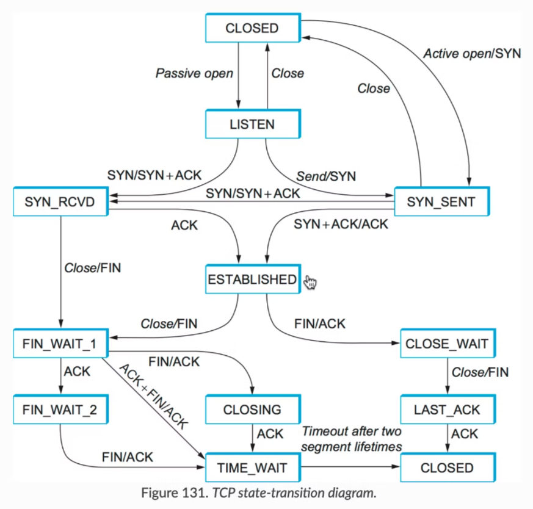

FSM de apertura y cierre de conexión. Todo lo que sucede mientras la conexión está abierta está “oculto” en ESTABLISHED

## 3.6 Principles of Congestion Control - NO ENTRA EN EL PARCIAL

## 3.7 TCP Congestion Control - NO ENTRA EN EL PARCIAL